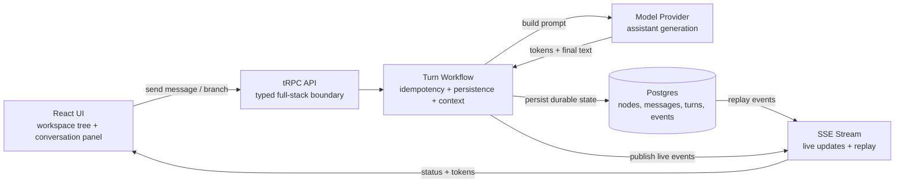
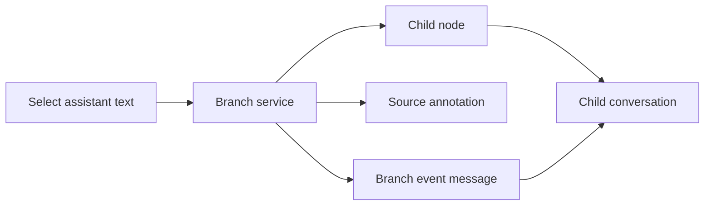

# Architecture Diagram

Use the first diagram for the walkthrough. It is intentionally small enough to read while screen sharing. The later sections are talking aids, not something to show all at once.

## Walkthrough Diagram



One-sentence narration:

```text
The frontend owns interaction state; the backend owns turn workflow correctness; Postgres is the durable source of truth; SSE gives the UI live feedback and replay after reconnect.
```

## Branch Flow Diagram

Use this only if you have time to show the branching path separately.



Narration:

```text
Branching is product data, not just navigation. The branch creates a child node, records the selected source span, and writes a branch event into the child conversation so the origin is visible to the user.
```

## Code Map

Do not put this in the diagram. Use it as your screen-share order.

```text
Live product
  -> ARCHITECTURE_DIAGRAM.md Walkthrough Diagram
  -> server/src/chat/runConversationTurnFlow.ts
  -> server/src/chat/turnExecutionPipeline.ts
  -> server/src/chat/stream/routes.ts
  -> server/src/annotations/branchAndSendFollowup.ts
```

## What To Say Out Loud

```text
This is a single-instance MVP architecture with durable recovery points. The production step is not changing the product model; it is replacing local infrastructure with shared production infrastructure.
```

## Production Hardening Overlay

If asked what changes for production:

```text
Process-local sessions -> Supabase-only validation, Redis, or database sessions
Process-local event broker -> Redis pub/sub or managed realtime bus
DB-polled worker -> real queue with retries and dead-letter handling
Local dev runtime -> CI/CD, deployment, health checks, secret management
Basic retrieval seams -> tested memory/retrieval policy with observability
```

## What The Diagram Should Not Claim

- no multi-agent planner
- no production distributed realtime
- no mature long-term memory system
- no cloud deployment topology yet

